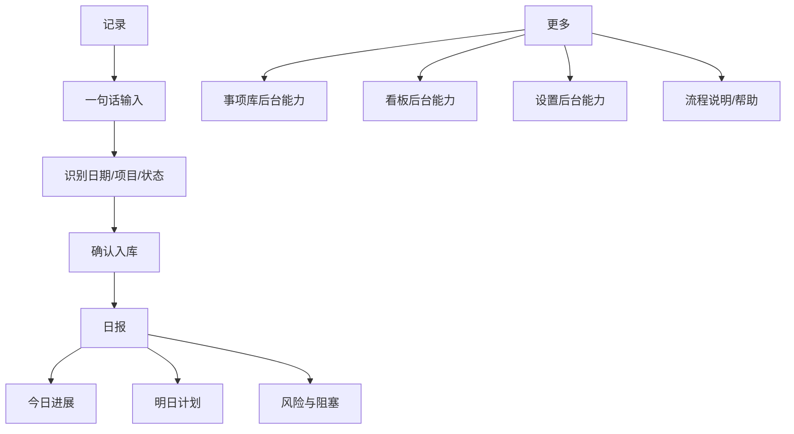

# Phase 1 原型设计

## 目标

先确认这个工具的产品形态：每天如何通过手机页面、当前对话或钉钉机器人记录动作和待办，如何自动归集到日期/项目，如何快速生成日报。当前阶段采用移动优先原型，不处理视觉精修、后端服务、钉钉真实接口或 AI 接入。

## 信息架构



## 页面清单

### 记录

用途：每天进入系统的默认页面，优先适配手机使用。

核心模块：
- 一句话记录：粘贴或接收来自当前对话、钉钉机器人的自然语言记录。
- 识别结果：自动识别完成事项、待办事项、日期、项目和来源。
- 最近记录：展示刚入库的事项，便于检查。
- 轻量统计：今日进展、明日计划、待确认数量。

空状态：
- 没有输入时，显示示例和识别说明。

主要跳转：
- 识别后确认入库，事项立即进入日报。
- 底部导航切换到日报，生成并复制报告。

### 智能收件箱

用途：承接随手输入的工作记录，不要求用户一开始就填写完整表单。

输入来源：
- 当前对话：你直接说“今天完成了 A，明天要做 B”，系统解析后形成候选事项。
- 钉钉机器人：你在钉钉里给机器人发消息，后续服务端接收后进入同一条解析链路。
- 页面粘贴：在工作台粘贴一段工作流水，适合批量补录。

识别结果：
- 完成事项：识别为已完成，并默认纳入当日/对应日期日报。
- 待办事项：识别为待办，若出现“明天、周五、月底”等时间词则转为截止时间或归属日期。
- 项目归集：根据项目名称、客户名、关键词、历史习惯匹配项目；低置信度时进入待确认。
- 标签归集：根据关键词匹配沟通、研发、运营、复盘、客户、钉钉等标签。

确认方式：
- 高置信度：自动入库，并在收件箱保留“可撤回/可编辑”的记录。
- 低置信度：进入待确认列表，用户选择项目、日期或状态后入库。

空状态：
- 没有待确认内容时，显示示例输入和最近一次入库记录。

### 日报

用途：按用户给定格式生成可复制日报。

核心模块：
- 报告类型：日报为第一优先级，周报/月报作为后续扩展。
- 报告预览：按“今日进展、明日计划、风险与阻塞”生成文本。
- 复制：复制后可发送到钉钉或其他渠道。

日报样式：

```text
【一、今日进展
1. ...
二、明日计划
1. ...
三、风险与阻塞

1. 关键问题：
2. 需协调：暂无】
```

### 更多

用途：承接低频能力，避免主界面过重。

二级能力说明：
- 事项库：用于查历史、改错别字、补项目、撤回误识别；当前不作为主入口。
- 看板：用于周报/月报和复盘统计；日报阶段先降级。
- 设置：用于维护项目关键词、钉钉机器人、日报模板；第一版尽量自动学习。
- 流程说明：用于原型阶段解释产品逻辑，定型后隐藏到帮助。

## 核心字段

### 事项

| 字段 | 类型 | 说明 |
| --- | --- | --- |
| 标题 | 文本 | 必填，描述要做或已完成的事项 |
| 描述 | 长文本 | 可选，补充背景 |
| 项目 | 枚举 | 由设置页维护 |
| 标签 | 多选 | 由设置页维护 |
| 工作类型 | 枚举 | 例：沟通、研发、运营、复盘、管理 |
| 状态 | 枚举 | 待办、进行中、已完成、延期、取消 |
| 优先级 | 枚举 | 高、中、低 |
| 日期 | 日期 | 记录归属日期 |
| 截止时间 | 日期时间 | 可选，用于提醒和逾期判断 |
| 耗时 | 数字 | 单位分钟或小时 |
| 结果 | 长文本 | 完成后填写，报告优先使用 |
| 阻塞点 | 长文本 | 用于风险和问题汇总 |
| 下一步 | 长文本 | 用于明日计划或下周计划 |
| 纳入报告 | 布尔 | 默认是 |
| 来源 | 枚举 | 页面、当前对话、钉钉机器人 |
| 原始输入 | 长文本 | 保存解析前的原文，方便回溯 |
| 识别置信度 | 数字 | 用于判断是否需要人工确认 |

### 智能输入

| 字段 | 类型 | 说明 |
| --- | --- | --- |
| 原文 | 长文本 | 用户在对话、钉钉或页面输入的原始内容 |
| 来源 | 枚举 | 当前对话、钉钉机器人、页面粘贴 |
| 解析状态 | 枚举 | 待解析、待确认、已入库、已忽略 |
| 候选日期 | 日期 | 从“今天、昨天、明天、周五”等表达识别 |
| 候选项目 | 枚举 | 根据关键词和历史规则匹配 |
| 候选状态 | 枚举 | 完成类表达为已完成，计划类表达为待办 |
| 候选事项 | 列表 | 一条输入可能拆成多条事项 |

### 报告

| 字段 | 类型 | 说明 |
| --- | --- | --- |
| 报告类型 | 枚举 | 日报、周报、月报 |
| 模板类型 | 枚举 | 职场汇报版、个人复盘版 |
| 日期范围 | 日期范围 | 自动或手动选择 |
| 生成内容 | 长文本 | 规则生成后的报告文本 |
| 润色状态 | 枚举 | 未润色、已润色 |
| 创建时间 | 日期时间 | 保存历史报告时使用 |

## 用户流程

### 每日记录

1. 打开今日工作台。
2. 直接在智能收件箱输入一段自然语言，例如“今天完成客户方案，明天跟进报价”。
3. 系统拆分为完成事项和待办事项，并自动匹配日期、项目、标签和状态。
4. 用户确认低置信度结果，或手动修正项目、日期和状态。
5. 晚上进入报告生成页，生成日报并复制。

### 对话/钉钉记录

1. 用户在当前对话或钉钉机器人里发送工作流水。
2. 系统保留原始输入，生成一组候选事项。
3. 对明确内容自动入库，对模糊项目或日期进入待确认。
4. 入库后的事项统一进入事项库、看板和报告生成。
5. 报告生成时可按来源筛选，检查哪些内容来自钉钉或当前对话。

### 周/月复盘

1. 进入日报页。
2. 选择周报或月报。
3. 系统自动筛选周期内纳入报告的事项。
4. 复制报告文本，必要时手动调整。

### 待办追踪

1. 今日工作台查看今日待办和逾期事项。
2. 点击事项进入详情。
3. 更新状态、截止时间、阻塞点或下一步。
4. 数据看板同步反映完成和延期趋势。

## 可视化指标定义

| 指标 | 计算方式 |
| --- | --- |
| 今日完成 | 日期为今天且状态为已完成的事项数 |
| 进行中 | 状态为进行中的事项数 |
| 逾期待办 | 截止时间早于当前时间且状态不是已完成/取消的事项数 |
| 待汇报 | 纳入报告为是，且当前周期内状态不是取消的事项数 |
| 完成率 | 已完成事项数 / 非取消事项数 |
| 延期率 | 延期事项数 / 非取消事项数 |
| 项目分布 | 按项目聚合当前周期事项数 |
| 周期趋势 | 按日期聚合完成事项数 |

## 当前验收标准

- 能看清系统有哪几个页面，以及每个页面负责什么。
- 能从原型判断每天记录事项的最短路径。
- 能从原型判断事项如何被筛选、汇总并进入报告。
- 能从原型判断日报、周报、月报的生成逻辑。
- 能识别下一阶段高保真设计稿需要补足的视觉和组件细节。
